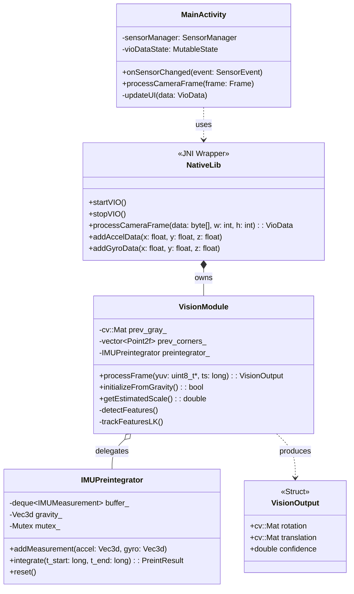
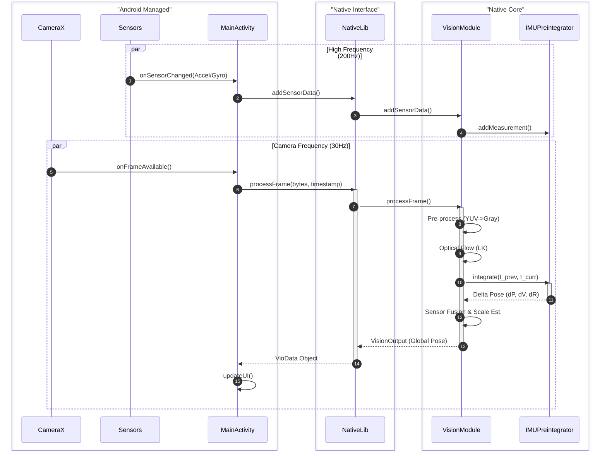
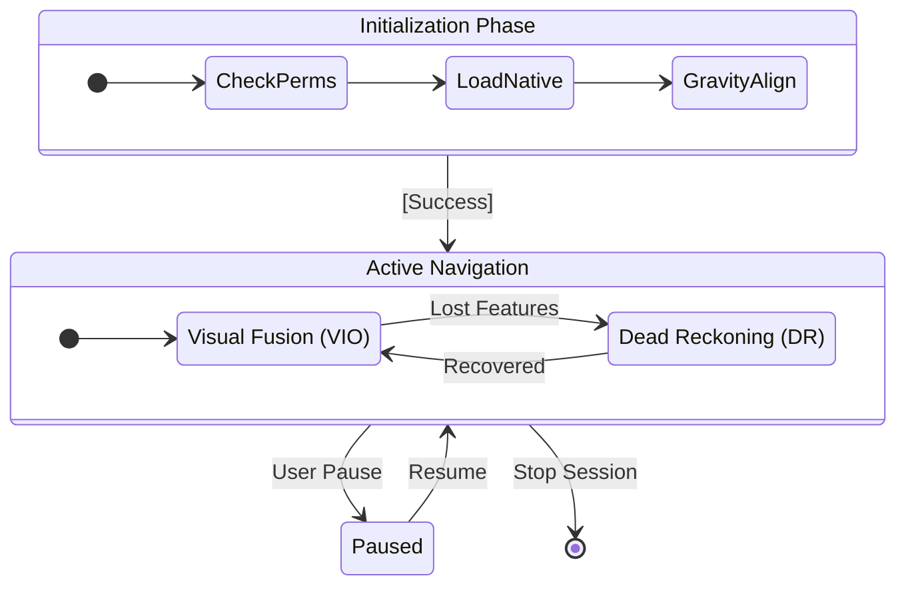

# NavSight
## Software Engineering B.Sc. Final Project
## Software Design Document

**Authors:**
* Roey Ben Harush (315676163)
* Tamir Sobuh (206029084)
* Morad Zubidat (208156828)

**Supervisor:**
* Mr. Amit Dunsky

**Date:** 15/01/2026

---

## 1. Introduction

### a. System Overview
NavSight is a self-contained, real-time mobile navigation system designed for Android devices. It leverages **Visual-Inertial Odometry (VIO)** combined with **Dead Reckoning (DR)** to provide continuous position tracking without dependence on Global Navigation Satellite Systems (GNSS). The system is engineered to operate entirely offline, processing sensor data locally on the device to deliver a responsive and private navigation experience. Its primary use case is urban micromobility, enabling users to navigate environments where GPS signals are unreliable or unavailable, such as dense urban canyons, tunnels, and indoor spaces.

### b. Purpose
The purpose of the NavSight system is to overcome the limitations of traditional satellite-based navigation in challenging environments. GNSS signals are often blocked, reflected, or degraded in urban canyons created by tall buildings, inside tunnels and underground passages, and within indoor environments. NavSight provides a reliable navigation alternative by using the device's own camera and motion sensors to track movement relative to a starting point, ensuring users can navigate confidently regardless of satellite signal availability.

### c. Scope
**In-Scope:**
*   **Visual Odometry (VO) Pipeline:** A robust computer vision pipeline that processes sequential camera frames to estimate relative motion. It utilizes sparse feature detection (**Shi-Tomasi**) and optical flow tracking (**Lucas-Kanade**) to determine the Essential Matrix and recover 6-DoF pose (rotation and translation).
*   **Inertial Preintegration:** A sophisticated module that integrates high-frequency (200Hz) accelerometer and gyroscope data between video frames. This implements **Manifold Preintegration** (Forster et al.) to reduce computational load and drift compared to standard integration.
*   **Sensor Fusion Logic:** A tightly-coupled fusion algorithm that combines VO pose estimates with preintegrated inertial measurements. This includes **Automatic Scale Estimation** to resolve the monocular scale ambiguity problem by comparing visual displacement with inertial displacement.
*   **Dead Reckoning (DR) Fallback:** A fail-safe mode that seamlessly transitions to inertial-only tracking when visual features are lost (e.g., in low light or texture-less areas), ensuring continuous navigation.
*   **Native Android Application:** A user-friendly mobile application built with **Kotlin** and **Jetpack Compose** that visualizes the 3D trajectory on a 2D map, displays real-time tracking metrics, and manages sensor permissions.
*   **Offline Operation:** The entire system runs locally on the device without any dependency on external servers or internet connectivity for positioning.

**Out-of-Scope:**
*   Full 3D Simultaneous Localization and Mapping (SLAM) with loop closure detection and global bundle adjustment.
*   Cloud-based processing, data storage, or remote telemetry.
*   Integration with external hardware sensors (e.g., LIDAR, external IMU).
*   Turn-by-turn navigation instructions or voice guidance features.

### d. Definitions and Acronyms
*   **VIO (Visual-Inertial Odometry):** A technique that estimates device motion by fusing visual information from a camera with inertial measurements from an IMU.
*   **VO (Visual Odometry):** The process of determining a device's position and orientation by analyzing sequential camera images.
*   **DR (Dead Reckoning):** A method of calculating current position by using a previously known position and advancing it based on estimated speed and direction from inertial sensors.
*   **IMU (Inertial Measurement Unit):** A sensor package typically containing accelerometers and gyroscopes that measures linear acceleration and angular velocity.
*   **JNI (Java Native Interface):** A framework that enables Java/Kotlin code running in the Android Runtime (ART) to call and be called by native applications and libraries written in C++.
*   **RANSAC (Random Sample Consensus):** An iterative algorithm to estimate parameters of a mathematical model from a set of observed data that contains outliers.
*   **KLT (Kanade-Lucas-Tomasi):** A feature tracker algorithm used for optical flow.

### e. Constraints
*   **Hardware Dependency:** System accuracy and stability are fundamentally limited by the quality of the device's sensors. Rolling shutter artifacts in cameras and bias instability in MEMS IMUs introduce errors that must be algorithmically mitigated.
*   **Environmental Limitations:** Visual odometry relies on the presence of distinct visual features. Performance degrades significantly in low-light, high-dynamic-range (glare), or low-texture environments (e.g., white walls).
*   **Real-Time Processing:** All computations (feature tracking, integration, fusion) must complete within the inter-frame interval (approx. 33ms at 30fps) to ensure real-time feedback and prevent lag.
*   **Power Consumption:** Continuous operation of the camera, high-frequency sensors, and CPU/GPU for processing places a heavy load on the battery. The architecture must balance accuracy with energy efficiency.
*   **Platform:** The application targets Android 10 (API level 29) and above, utilizing the Android NDK for performance-critical C++ components.

---

## 2. System Architecture

### a. Architectural Description and Design: Roles, Activities and Data
The NavSight system employs a **Layered Architecture** designed for modularity, high performance, and separation of concerns.

#### Layer 1: Presentation Layer (Android UI)
*   **Role:** User Interaction & Visualization.
*   **Technology:** Kotlin, Jetpack Compose.
*   **Responsibilities:**
    *   Renders the live camera preview using `CameraView`.
    *   Overlays tracked visual features (green dots) for user feedback.
    *   Visualizes the estimated 3D trajectory on a 2D top-down map.
    *   Displays real-time debug metrics: Tracking Quality (%), Scale Factor (m/unit), Initialization Status, and raw sensor values.
    *   Handles user input (Start, Stop, Pause, Reset).

#### Layer 2: Application Logic Layer (Orchestrator)
*   **Role:** System Orchestration & Sensor Management.
*   **Technology:** Kotlin, Android SDK (`SensorManager`, `CameraX`).
*   **Responsibilities:**
    *   Manages the application lifecycle and permissions (`CAMERA`, `ACCESS_FINE_LOCATION`).
    *   Initializes and synchronizes hardware sensors (Accelerometer @ 200Hz, Gyroscope @ 200Hz, Camera @ 30fps).
    *   Acts as the bridge between the UI and the Native Core, passing raw data down and receiving processed `VioData` objects up.

#### Layer 3: Native Interface Layer (JNI Bridge)
*   **Role:** Data Marshalling & Thread Management.
*   **Technology:** C++, JNI.
*   **Responsibilities:**
    *   Marshals data between the Java Virtual Machine (JVM) and the Native Heap (converting `ByteArray` frame data to `cv::Mat`).
    *   Manages the dedicated background **VIO Thread** to ensure heavy processing never blocks the UI.
    *   Provides thread-safe queues (`frame_queue`, `accel_queue`) for asynchronous data ingestion.

#### Layer 4: Native Processing Core (C++)
*   **Role:** Algorithmic Computation (The Engine).
*   **Technology:** C++, OpenCV 4.x.
*   **Components:**
    *   **`VisionModule`:** The computer vision powerhouse. It handles feature detection, KLT optical flow tracking, Essential Matrix estimation, and outlier rejection (RANSAC).
    *   **`IMUPreintegrator`:** A mathematical module that performs on-manifold integration of raw inertial data. It calculates the delta-position, delta-velocity, and delta-rotation accumulated between two camera frames.
    *   **`SensorFusionEngine`:** The logic core that fuses the visual pose with the preintegrated inertial pose. It handles **Automatic Scale Estimation**, **Gravity Alignment**, and the dynamic switching between VIO and Dead Reckoning modes.

### b. The Life Cycle of the System
1.  **Initialization:** The app launches, requests permissions, and loads the `native-lib.so`. Sensors are started.
2.  **Calibration (Gravity Alignment):** The system buffers ~20 accelerometer samples while the device is stationary (checked via variance). It computes the mean acceleration vector to determine the direction of gravity (Z-down) and aligns the initial coordinate frame.
3.  **Active Tracking (VIO Mode):**
    *   Camera frames are processed to track features.
    *   IMU data is preintegrated to predict motion.
    *   Visual and Inertial estimates are fused.
    *   Global pose is updated and sent to the UI.
4.  **Degraded Tracking (DR Mode):** If visual tracking fails (e.g., < 8 features found, or motion is degenerate), the system flags the vision output as invalid. The Global Pose is then propagated using *only* the IMU preintegration results (Dead Reckoning).
5.  **Recovery:** The system continues attempting to detect features. Once sufficient features (e.g., > 15) are successfully tracked and verified via RANSAC, the system re-initializes visual tracking and seamlessly merges it back into the fusion filter.
6.  **Termination:** User stops the session -> Native threads serve a stop signal -> Resources are released -> Session summary is displayed.

---

## 3. Literature Survey

### a. Problem Survey
Visual-Inertial Odometry (VIO) addresses the fundamental challenge of estimating a device's 6-DoF state (position, orientation, velocity) using only onboard sensors.
*   **Cameras** provide rich geometric information but suffer from scale ambiguity (in monocular setups), motion blur, and depend on texture/lighting.
*   **IMUs** provide high-frequency motion data immune to visual conditions but suffer from bias and noise that cause position estimates to drift rapidly (quadratic error growth) when double-integrated.
*   The challenge is fusing these complementary sensors to correct each other: Vision corrects IMU drift, while IMU provides scale and handles fast motion where vision fails.

### b. Solution Survey
*   **Feature-based Methods (ORB-SLAM):** Extract and track keypoints (ORB, SIFT). Accurate but computationally expensive.
*   **Direct Methods (LSD-SLAM):** Operate directly on pixel intensities. Good for low texture but sensitive to lighting changes.
*   **Filter-based VIO (MSCKF):** Uses an Extended Kalman Filter (EKF) to maintain a state vector. Very efficient but hard to implement correctly (consistency issues).
*   **Optimization-based VIO (VINS-Mono):** Solves a nonlinear least-squares problem over a sliding window of keyframes. State-of-the-art accuracy but requires significant CPU.

### c. Discussion and Conclusion
NavSight implements a **lightweight optimization-based approach** tailored for mobile constraints.
*   We use **Sparse Optical Flow (KLT)** rather than feature descriptors (ORB) for speed.
*   We use **IMU Preintegration** (Forster et al.) to decouple the IMU integration rate (200Hz) from the camera rate (30Hz), avoiding expensive re-integration.
*   We employ a **Tightly-Coupled Fusion** strategy where the IMU constraints directly influence the scale and rotation of the visual estimate, rather than just loosely blending two separate paths.
This balance allows NavSight to run in real-time on mid-range Android devices while maintaining robustness in challenging urban scenarios.

---

## 4. Design

### a. Data Design

#### i. Database Description
The system is designed for complete offline operation and does not utilize a traditional persistent database. All session data is stored ephemerally in the device's RAM (Heaps) during an active tracking session.

#### ii. Global Data Structures Design
The system relies on strict data structures for inter-process communication:

1.  **`VioData` (Kotlin Data Class):** Passed from Native to UI.
    ```kotlin
    data class VioData(
        val x: Double, val y: Double, val z: Double, // Position (Meters)
        val roll: Double, val pitch: Double, val yaw: Double, // Euler Angles (Radians)
        val trackedPoints: FloatArray, // Flattened 2D array [x1, y1, x2, y2...]
        val trackingQuality: Double, // 0.0 - 1.0 confidence metric
        val estimatedScale: Double, // Current metric scale (meters/unit)
        val isInitialized: Boolean, // Gravity alignment status
        val accelX: Float, val accelY: Float, val accelZ: Float, // Raw IMU for debug
        val gyroX: Float, val gyroY: Float, val gyroZ: Float
    )
    ```

2.  **`VisionOutput` (C++ Struct):** The result of processing a single frame.
    ```cpp
    struct VisionOutput {
        cv::Mat rotation;       // 3x3 Relative Rotation Matrix (R_k_k-1)
        cv::Mat translation;    // 3x1 Relative Translation Vector (t_k_k-1)
        int tracked_features;   // Number of valid points tracked
        double tracking_quality;// Ratio of inliers to total points
        bool is_valid;          // Flag: True if tracking succeeded
    };
    ```

3.  **`PreintegratedIMU` (C++ Struct):** The result of Manifold Preintegration.
    ```cpp
    struct PreintegratedIMU {
        cv::Vec3d delta_p;      // Accumulated Position Change (meters)
        cv::Vec3d delta_v;      // Accumulated Velocity Change (m/s)
        cv::Mat delta_R;        // Accumulated Rotation Change (Matrix)
        double dt;              // Total integration time interval (seconds)
    };
    ```

### b. Structural Design

#### i. Class Diagram


### c. Algorithm Design

This section details the mathematical and logical operations of the core components.

#### i. Feature Detection: Shi-Tomasi (GFTT)
To track camera motion, the system must first identify "features"—points in the image that are easy to track (typically corners). We use the **Shi-Tomasi** corner detector, which is an improvement on the Harris detector.
*   **Logic:** For every pixel $(u, v)$, we compute the gradient matrix $M = \sum w(x,y) \begin{bmatrix} I_x^2 & I_x I_y \\ I_x I_y & I_y^2 \end{bmatrix}$.
*   **Criterion:** A pixel is a corner if both eigenvalues $\lambda_1, \lambda_2$ of $M$ are above a threshold. Shi-Tomasi simplifies this to checking if $min(\lambda_1, \lambda_2) > \lambda_{thresh}$.
*   **Optimization:** We limit detection to 200 features and enforce a minimum Euclidean distance between points to ensure a uniform distribution across the image.

#### ii. Feature Tracking: Lucas-Kanade Optical Flow (KLT)
Once features are detected in Frame $N-1$, we find their new positions in Frame $N$ using **Lucas-Kanade (LK) Optical Flow**.
*   **Assumption:** The brightness of a pixel does not change between frames ($I(x,y,t) = I(x+dx, y+dy, t+dt)$), and local neighbors move together.
*   **Pyramidal Implementation:** To handle large motions, we use a Gaussian Image Pyramid. Tracking starts at the lowest resolution (coarse level) to handle large displacements and refines the position at higher resolutions (fine levels).
*   **Output:** A set of point correspondences $(p_{n-1}, p_n)$ linking the two frames.

#### iii. Pose Estimation: Essential Matrix & RANSAC
Given the set of point correspondences, we estimate the camera's motion.
*   **Epipolar Constraint:** For a valid motion, points must satisfy $p_n^T E p_{n-1} = 0$, where $E$ is the Essential Matrix.
*   **RANSAC (Random Sample Consensus):** Real-world tracking contains outliers (moving objects, bad matches). RANSAC iteratively selects 5 random points, computes a hypothesis $E$, and checks how many other points fit this model (inliers). The model with the most inliers is chosen.
*   **Decomposition:** The best $E$ is decomposed using Singular Value Decomposition (SVD) into the Rotation Matrix ($R$) and Translation Vector ($t$). Note that $t$ is normalized (scale = 1).

#### iv. Inertial Preintegration (Manifold)
To process high-frequency IMU data efficiently without re-integrating it every time the vision pose is updated, we use **Manifold Preintegration**.
*   **Concept:** Instead of integrating position/velocity in the global frame (which changes as the pose estimate changes), we integrate motion *relative* to the frame $k$.
*   **Rotation:** We accumulate gyroscope readings on the SO(3) manifold:
    $\Delta R_{ij} = \prod_{k=i}^{j-1} Exp(\omega_k \Delta t)$
*   **Velocity & Position:** We sum accelerometer readings, rotating them by the accumulated $\Delta R_{ij}$ to keep them in the local frame.
    $\Delta v_{ij} = \sum_{k=i}^{j-1} \Delta R_{ik} a_k \Delta t$
    $\Delta p_{ij} = \sum_{k=i}^{j-1} (\Delta v_{ik} \Delta t + \frac{1}{2} \Delta R_{ik} a_k \Delta t^2)$
*   **Result:** This gives us a rigorous measurement of "how much the device moved" purely from IMU data, which is then used to constrain the visual estimation.

#### v. Automatic Scale Estimation
To solve the monocular scale ambiguity (where a 1m move looks like a 10m move at 10x distance), we compare Visual and Inertial measurements.
*   **Visual Displacement:** $d_{vis} = ||t_{vis}||$ (Unitless)
*   **Inertial Displacement:** $d_{imu} = ||\Delta p_{imu}||$ (Meters)
*   **Scale Factor:** $s = d_{imu} / d_{vis}$
*   **Filtering:** The raw scale factor is noisy. We use an exponential moving average filter ($s_{new} = \alpha \cdot s_{raw} + (1-\alpha) \cdot s_{prev}$) to smooth the estimate over time, converging to the true metric scale.

### d. Interactions Design

#### i. Use Cases
*   **UC-1: Track Navigation Path:** User starts app -> Calibrates -> Walks route -> System records 3D path -> User stops -> Summary shown.
*   **UC-2: Handle Degraded Visuals:** User enters dark tunnel -> Visual tracking fails -> System switches to Dead Reckoning (IMU only) -> Alert shown -> User exits tunnel -> Visual tracking resumes.
*   **UC-3: Pause/Resume:** User pauses tracking -> Sensor stream stops -> User resumes -> Tracking continues from last known state.

#### ii. Sequence Diagram (Main Processing Loop)


#### iii. Activity Diagram (System States)


### e. Software Architecture Pattern

#### i. Three-tier Architecture
The system rigidly adheres to a three-tier model:
1.  **Presentation Tier:** Android Views (XML/Compose) handles all UI/UX.
2.  **Logic Tier:** Kotlin Orchestrator & NativeLib handles state, permissions, and lifecycle.
3.  **Data/Computation Tier:** C++ Native Core handles the heavy lifting (VIO/IMU algorithms).

#### ii. MVC (Model-View-Controller)
*   **Model:** `VioData` (Kotlin) and `VisionOutput`/`GlobalPose` (C++).
*   **View:** `MainActivity` layout (Compose UI).
*   **Controller:** `MainActivity` and `native-lib` logic binding the two.

### f. Testing Platform
*   **Unit Testing:** GoogleTest (GTest) framework is used to verify the C++ modules (`VisionModule`, `IMUPreintegrator`) in isolation on a desktop environment before deployment.
*   **Integration Testing:** `Espresso` and `JUnit` are used to test the Android application logic and JNI boundary.
*   **Field Testing:** Manual validation is performed in diverse real-world environments (e.g., office hallways, outdoor streets, stairwells) to benchmark drift and robustness against ground truth (e.g., loop closure return-to-start accuracy).

---

## 5. Appendix-A
### a. POC discussion
A Proof-of-Concept (POC) was conducted to validate the feasibility of running VIO on mid-range Android hardware. The POC successfully demonstrated:
1.  **JNI Linkage:** Seamless communication between Kotlin and OpenCV C++.
2.  **Feature Tracking:** Stable Shi-Tomasi/Lucas-Kanade tracking at 30fps.
3.  **Sensor Access:** Reliable retrieval of high-frequency IMU data (200Hz).
The POC confirmed that the computational budget (<33ms/frame) is achievable.

## 6. Appendix-B
### a. Team Roles
*   **Roey Ben Harush (Team Lead / Main Developer):**
    *   Lead Android application development (Kotlin, Jetpack Compose).
    *   System architecture design and layer separation.
    *   JNI bridge implementation and thread management.
*   **Tamir Sobuh (Native Core Developer):**
    *   C++ native processing core development.
    *   `VisionModule` implementation (Optical Flow, Feature Detection).
    *   Native code optimization and Unit Testing (GTest).
*   **Morad Zubidat (Algorithm & Integration Developer):**
    *   `IMUPreintegrator` module implementation.
    *   Sensor Fusion algorithm and Automatic Scale Estimation logic.
    *   System integration testing and documentation.

## 7. Appendix-C
### a. Schedule / Gantt
*(Refer to external Gantt chart document or project management tool)*

## 8. Appendix-D
### a. System Screens
*(Refer to design mockups and screenshots folder)*
