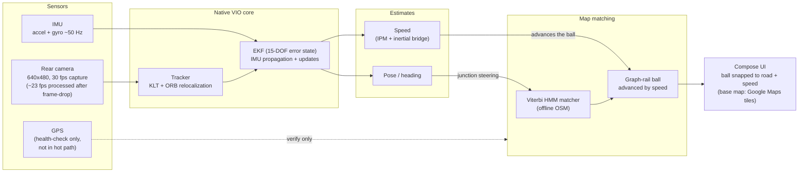

# NavSight — End-to-End Data Flow (sensors -> EKF -> map ball -> UI)

>_SUPERSEDED: the deck uses the single full-system diagram diagrams/pro/png/00-system-architecture-full.png; this sub-diagram is reference-only._

**Presenter caption:** Camera and IMU feed the native EKF/Tracker; estimated speed and pose flow into the on-device offline Viterbi OSM road-matcher. Speed is what advances the graph-rail ball along the locked road, and heading steers it at junctions. GPS is used only as an out-of-loop health check — it never drives the navigation hot path. The navigation is GPS-free and computed on-device (offline OSM road-matching, no network in the navigation hot path); the base map shown under the ball uses Google Maps tiles.
