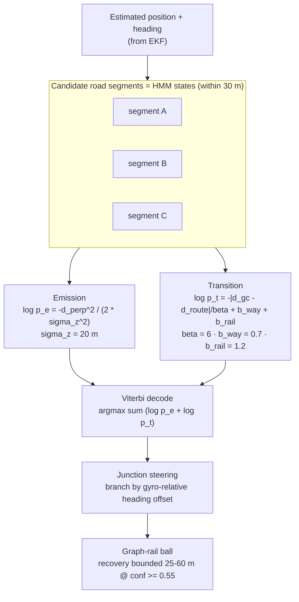

>_SUPERSEDED: the deck uses the single full-system diagram diagrams/pro/png/00-system-architecture-full.png; this sub-diagram is reference-only._

# NavSight — HMM Map Matching (Newson & Krumm, Viterbi)

**Presenter caption:** Candidate road segments within 30 m are HMM states. Emission scores perpendicular distance (Gaussian, sigma_z = 20 m); transition rewards travel-distance consistency plus same-way (0.7) and rail (1.2) bonuses. Viterbi decodes the most likely road path, and at junctions the gyro-relative heading offset picks the branch. Wrong-fork recovery is bounded to 25-60 m at confidence >= 0.55, so the ball can never teleport across town.
