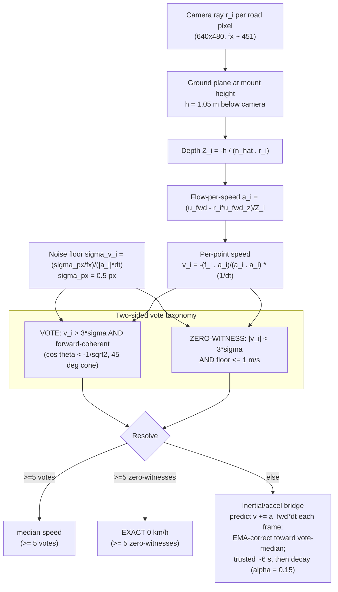

# NavSight — Speed Estimation via Inverse Perspective Mapping (IPM)

>_SUPERSEDED: the deck uses the single full-system diagram diagrams/pro/png/00-system-architecture-full.png; this sub-diagram is reference-only._

**Presenter caption:** The road is modelled as a plane at calibrated height h = 1.05 m, so each road pixel's ray gives a metric depth and a least-squares per-point speed from measured optical flow. A two-sided taxonomy classifies each point: a forward-coherent point above 3-sigma VOTES, a point at the noise floor is a ZERO-WITNESS. Five or more votes give the median speed; five or more zero-witnesses force an exact 0 km/h standstill lock; otherwise the inertial/accel bridge predicts speed by integrating forward acceleration each frame and EMA-corrects toward the vote-median, carrying speed for up to ~6 s before decaying (alpha = 0.15 is the post-budget decay rate, not the correction gain). The zero-witness branch is why standstill reads exactly 0 instead of rectifying noise into phantom speed.
