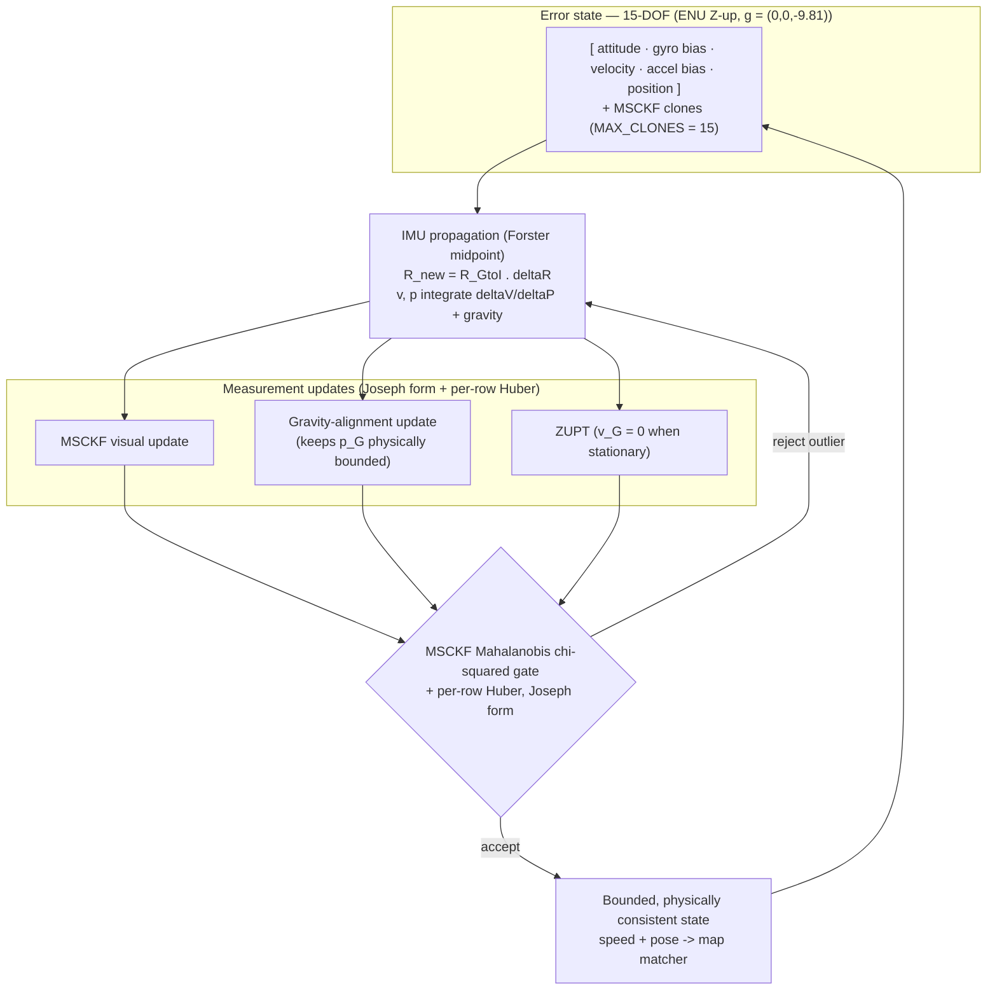

# NavSight — 15-DOF Error-State EKF Pipeline

>_SUPERSEDED: the deck uses the single full-system diagram diagrams/pro/png/00-system-architecture-full.png; this sub-diagram is reference-only._

**Presenter caption:** The filter carries a 15-DOF navigation error state (attitude, gyro bias, velocity, accel bias, position) in an ENU Z-up world, plus MSCKF clone blocks (the full IMU error-state is 19-DOF, adding the camera-IMU time offset and the body->camera extrinsic). IMU preintegration propagates the state; MSCKF visual, gravity-alignment, and ZUPT updates correct it via Joseph-form math. The live per-frame gate is the MSCKF Mahalanobis chi-squared gate (5x chi^2_0.95(2K); landmark per-obs gate 5.991) with per-row Huber (delta=2.4477), rejecting physically impossible residuals. Debugging lesson: a ~6-10 deg tilt mis-cancelled gravity and produced ~800 m of phantom Z drift; we found it by reading the residual data, not by tuning constants for days, and fixed it with the live gravity-alignment update — read the data before tuning constants.
